# Отчет по выполнению тестового задания

## Задание 1.1: Развертывание инфраструктуры

### Выполненные действия:

**1. Установка Docker инфраструктуры**
   - Kafka + Zookeeper
   - PostgreSQL
   - Kafka UI для мониторинга

   


**2. Создание топика Kafka**
```bash
   docker exec kafka kafka-topics --create \
     --topic test-topic \
     --bootstrap-server localhost:9092 \
     --partitions 3 \
     --replication-factor 1
```
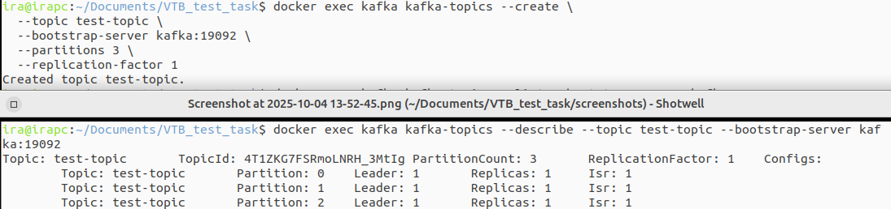


**3. Создание таблицы в PostgreSQL**

```sql
CREATE TABLE messages (
    id SERIAL PRIMARY KEY,
    msgUuid VARCHAR(36) NOT NULL UNIQUE,
    head BOOLEAN NOT NULL,
    timeRq BIGINT NOT NULL
);
```
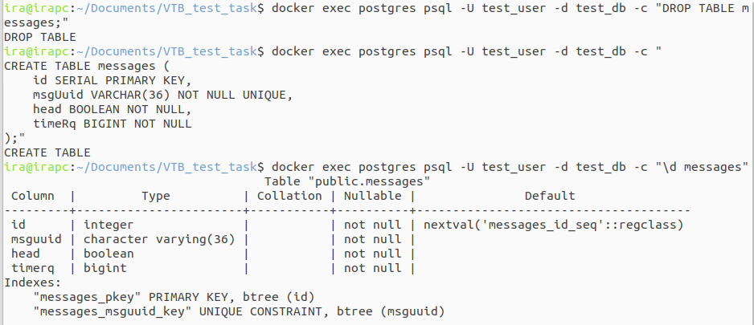

### Результат:
- Kafka запущена на localhost:9092
- PostgreSQL запущен на localhost:5432
- Топик test-topic создан с 3 партициями
- Таблица messages создана в БД


## Задание 1.2: Нагрузочное тестирование JMeter

### Конфигурация теста:
**Сценарий нагрузки:**
- Ступень 1: 5 оп/с (5 минут)
- Ступень 2: 10 оп/с (5 минут)
- Ступень 3: 12 оп/с (5 минут)
- Ступень 4: 14 оп/с (5 минут)

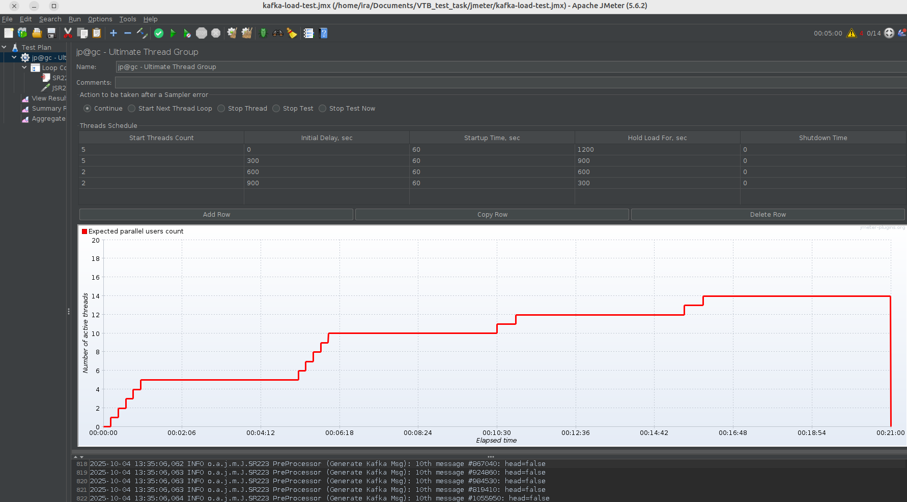


### Генерация сообщений:

- Случайный UUID для каждого сообщения
- Каждое 10-е сообщение: head: false
- Формат JSON согласно ТЗ

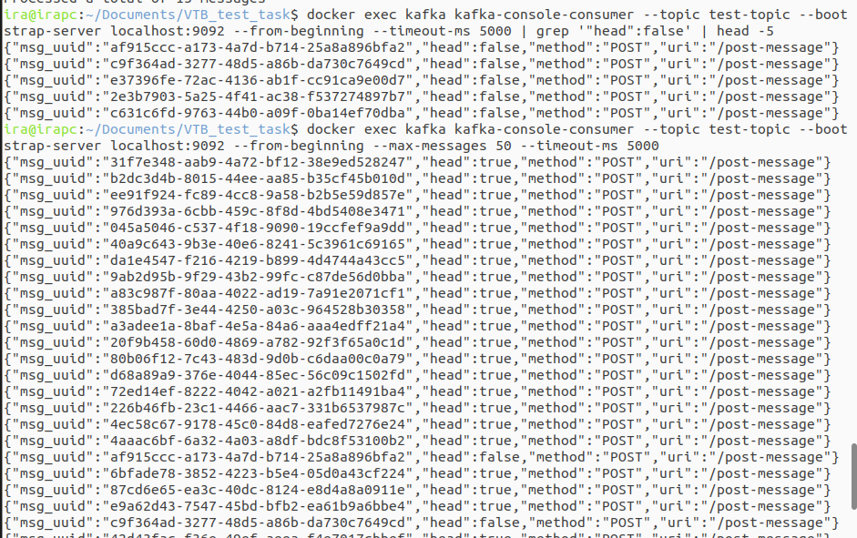
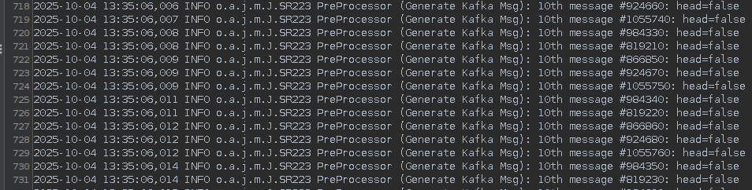


### JMeter Test Plan структура:

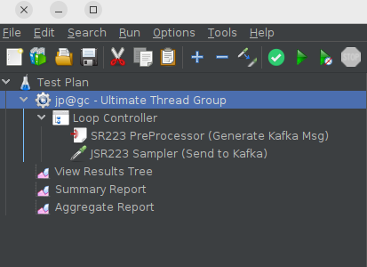


### Результаты тестирования:
**Метрики:**
- Общее время теста: 20 минут
- Отправлено сообщений: 11158331
- Сообщений с head: false: ~1115833.1 (10%)
- Ошибок: 0%


### Проблемы и решения:
- **Проблема**: Kafka Producer был недоступен
- **Решение**: Использован JSR223 Sampler
- **Проблема**: Счетчик сообщений сбрасывался
- **Решение**: Реализован глобальный AtomicLong счетчик


## Задание 1.3: Spring Boot потребитель Kafka

### Реализованный функционал:

1. **Заглушка постоянно слушает топик Kafka** 

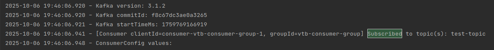


2. **Данные корректно извлекаются и сохраняются в соответствующие столбцы таблицы**

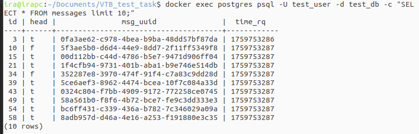

3. **Многопоточная обработка**:

- 3 параллельных консьюмера

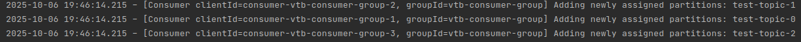

- Распределение по партициям Kafka

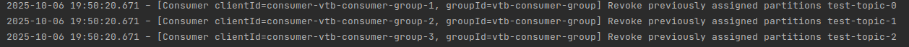

4. **Логирование в формате ТЗ**:

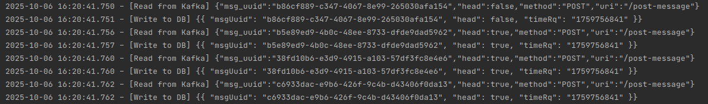


## Задание 2: Мониторинг и визуализация метрик

### Выполненные действия:

1. **Развертывание локальной Grafana**

**Инфраструктура мониторинга:**

- Grafana развернута в Docker контейнере
- Prometheus как система сбора метрик
- PostgreSQL Exporter для метрик базы данных
- Spring Boot Actuator для JVM метрик приложения