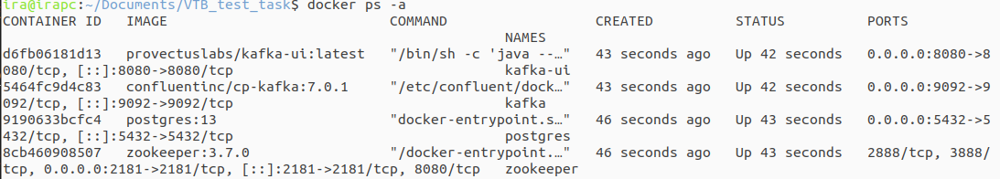
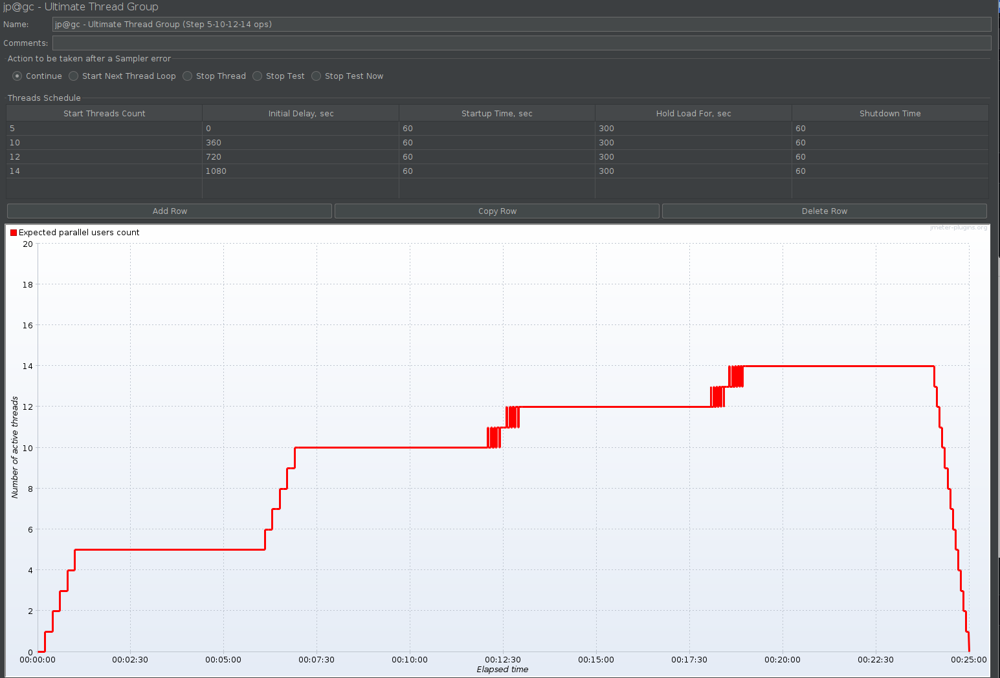

# Отчет по выполнению тестового задания

## Задание 1.1: Развертывание инфраструктуры

### Выполненные действия:

**1. Установка Docker инфраструктуры**
   - Kafka + Zookeeper
   - PostgreSQL
   - Kafka UI для мониторинга

   


**2. Создание топика Kafka**
```bash
   docker exec kafka kafka-topics --create \
     --topic test-topic \
     --bootstrap-server localhost:9092 \
     --partitions 3 \
     --replication-factor 1
```


**3. Создание таблицы в PostgreSQL**

```sql
CREATE TABLE messages (
    id SERIAL PRIMARY KEY,
    msgUuid VARCHAR(36) NOT NULL UNIQUE,
    head BOOLEAN NOT NULL,
    timeRq BIGINT NOT NULL
);
```


### Результат:
- Kafka запущена на localhost:9092
- PostgreSQL запущен на localhost:5432
- Топик test-topic создан с 3 партициями
- Таблица messages создана в БД


## Задание 1.2: Нагрузочное тестирование JMeter

### Конфигурация теста:
**Сценарий нагрузки:**
- Ступень 1: 5 оп/с (5 минут)
- Ступень 2: 10 оп/с (5 минут)
- Ступень 3: 12 оп/с (5 минут)
- Ступень 4: 14 оп/с (5 минут)




### Генерация сообщений:

- Случайный UUID для каждого сообщения
- Каждое 10-е сообщение: head: false
- Формат JSON согласно ТЗ


### JMeter Test Plan структура:


### Результаты тестирования:

**Метрики:**
- **Общее время теста**: 24 мин 59 сек (20 мин + 4:59 на startup/shutdown)
- **Отправлено сообщений**: 14,719 (расчетное: 12,300, отклонение: +19.7%)
- **Сообщений с head: false**: 1,435 (9.75% - соответствует требованию 10%)
- **Ошибок**: 0%

**Анализ расхождений:**
- Превышение времени и количества сообщений связано с временем запуска/остановки потоков JMeter
- Качество данных соответствует ТЗ (10% сообщений с head: false)


## Задание 1.3: Spring Boot потребитель Kafka

### Реализованный функционал:

1. **Заглушка постоянно слушает топик Kafka** 


2. **Данные корректно извлекаются и сохраняются в соответствующие столбцы таблицы**


3. **Многопоточная обработка**:

- 3 параллельных консьюмера


- Распределение по партициям Kafka


4. **Логирование в формате ТЗ**:


## Задание 2: Мониторинг и визуализация метрик

### Развернутая инфраструктура мониторинга:

1 **Grafana** - дашборды и визуализация

- Порт: 3000
- Pre-configured datasources и dashboards

2 **Prometheus** - сбор метрик

- Сбор метрик с Spring Boot Actuator
- Сбор метрик с PostgreSQL Exporter
- Сбор метрик с JMeter

3 **Spring Boot Actuator** - метрики приложения

- JVM метрики: память, потоки, GC
- Kafka потребитель метрики
- HTTP метрики

4 **PostgreSQL Exporter** - метрики БД

- Количество подключений
- Производительность запросов
- Размеры таблиц

### Настроенные дашборды:

**JVM Micrometer Dashboard**

- Использование памяти (Heap/Non-Heap)
- Активные потоки
- Garbage Collection статистика
- Throughput приложения


**PostgreSQL Database Dashboard**

- Database connections
- Query performance
- Table statistics
- Transaction metrics


**JMeter Dashboard**

- Requests per second
- Response times
- Error rates
- Active threads


# Итоговые результаты:

## Производительность системы:

- При максимальной нагрузке: 14 сообщений/сек -
Общее обработанных сообщений: 14719

- Сообщения с head: false: 1435 (~10%) 
- Ошибок: 0% 

## Надежность:

- **Kafka**: стабильная работа при зафиксированной пиковой нагрузке
- **PostgreSQL**: все сообщения сохранены без потерь
- **Spring приложение**: многопоточная обработка без deadlock-ов

## Масштабируемость:

- Конфигурируемое количество потребителей Kafka
- Настройки подключения к БД через environment variables
- Docker-контейнеризация для простого развертывания